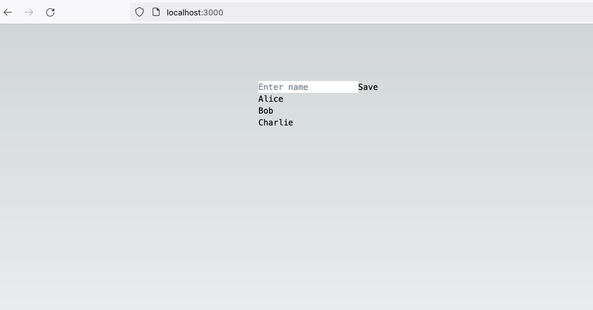
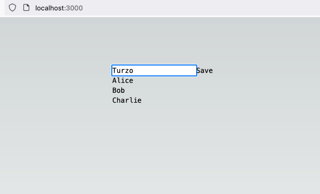
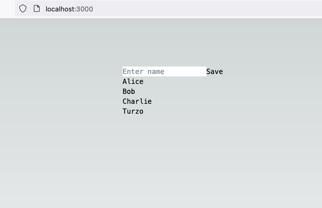

## Connect SQLite database with NextJS

This project is a demonstration about how to interect with SQLite and NextJS. The below example features were implemented.

- How to save new data?
- How to fetch existing data from table?







## Getting Started

First, run the development server:

```bash
npm run dev
```

Open [http://localhost:3000](http://localhost:3000) with your browser to see the result.
